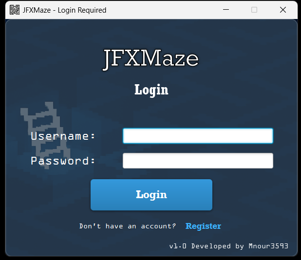
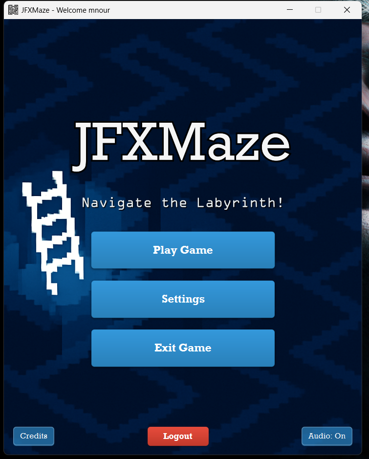
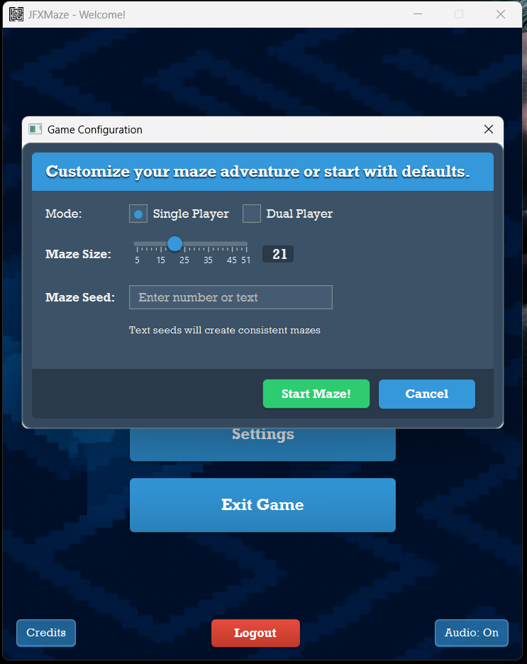
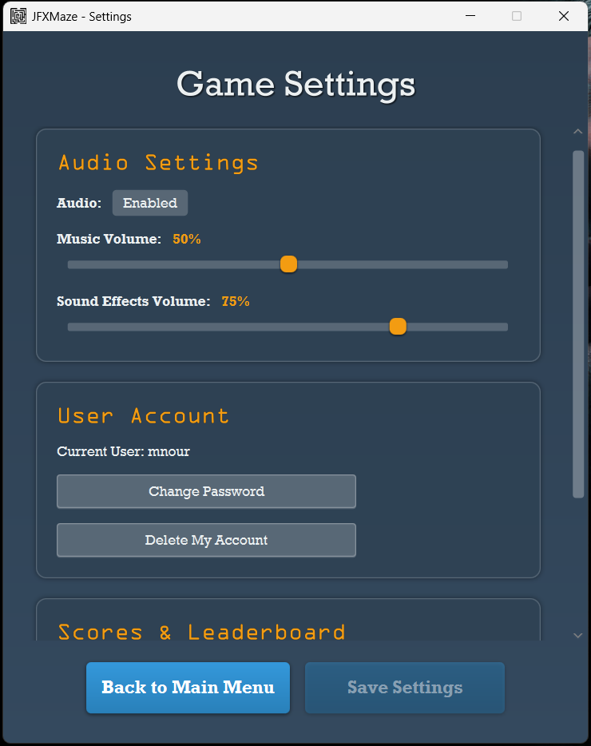
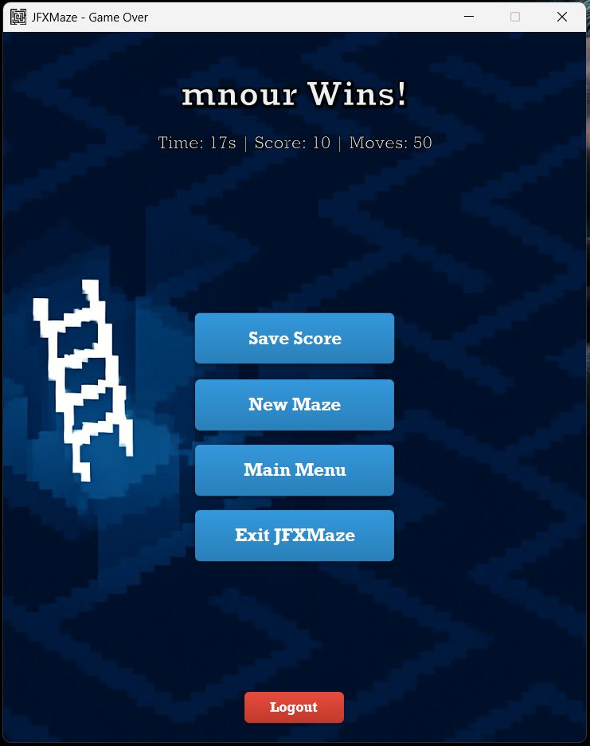
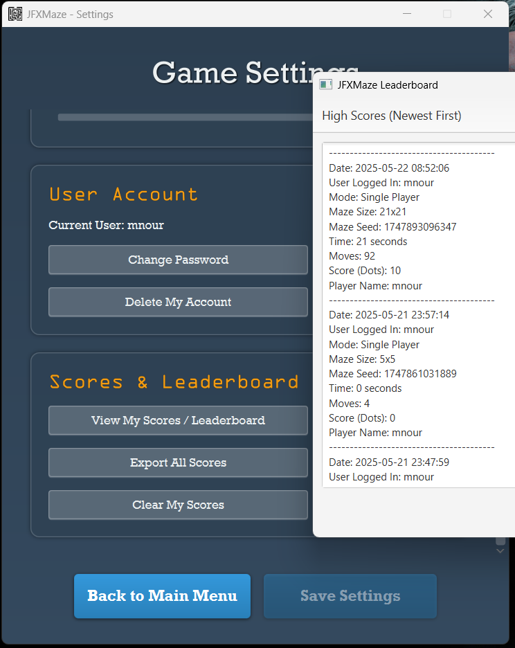
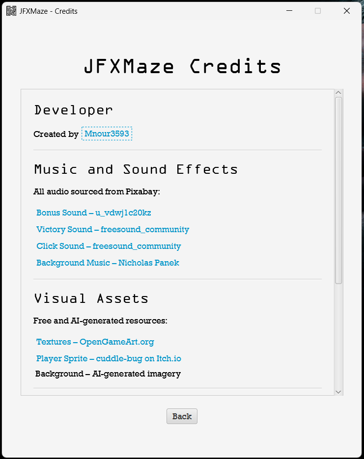

# 🎮 JFXMaze

**JFXMaze** is a JavaFX-based reimagination of my original terminal game C-Maze, featuring a polished GUI, user authentication, customizable settings, and rich visuals.
> [!NOTE]
> This is V3 of C-Maze now fully graphical with JavaFX, FXML layouts, and Maven support!

## 🎮 Gameplay Demo

Check out a short gameplay demo of **JFXMaze** on YouTube:  
[](https://youtube.com/shorts/l4Rtd7CSkpI)

Watch the maze in action and see how the game plays!


---

## 🛠 Project Structure

```

JFXMaze/
├── dist/               ← a folder that includes the JAR to run the game without an IDE.
│   │   └── javafx/     ← JavaFX libraries required to run the JAR
│   ├── JFXMaze-1.0-SNAPSHOT-jar-with-dependencies.jar
│   ├── README.txt
│   ├── run_jfxmaze_standalone.bat
├── images/             ← screenshots of UI flows (.png)
│   ├── login.png
│   ├── welcome.png
│   ├── settings.png
│   ├── credits.png
│   ├── gameprompt.png
│   ├── gamescreen.png
│   ├── endgame.png
│   └── scores.png
├── src/
│   ├── main/
│   │   ├── java/       ← Java source files and controllers
│   │   └── resources/  ← FXML layouts, CSS, images
├── pom.xml             ← Maven build & dependencies
└── README.md

````

---

## 🚀 Features & Flow

1. **Startup & Auth**  
   - `Main.java` boots the JavaFX app.  
   - `UserAuth` presents **Login / Register**.

2. **Welcome & Menu**  
   - `WelcomeController` shows your username and options: **Play**, **Settings**, **Credits**, **Logout**.

3. **Custom Settings**  
   - `SettingsController` lets you adjust: maze size, game mode, seed, audio, and export scores.

4. **Gameplay**  
   - `MazeModel` generates the maze.  
   - `MazeRenderer` draws walls, paths, bonus dots, exit, and players.  
   - `GameScreenController` handles movement (WASD / arrows), timer, move-counter, and bonus collection.

5. **Scoring & Endgame**  
   - `EndGameController` displays final stats and “Save Score” prompt.  
   - `ScoreManager` writes to `jfxmaze_scores.txt` and reloads score history.

6. **Credits**  
   - `CreditsController` lists acknowledgements and asset sources.

---

## 🖥️ Installation & Run
> [!IMPORTANT]
> This project requires Java JDK and Maven to download required libraries, build, compile and run the game.

1. **Clone & Enter**  
   ```bash
   git clone https://github.com/Mnour3593/JFXMaze.git
   cd JFXMaze


2. **Build with Maven**

   ```bash
   mvn clean package
   ```

3. **Launch**

   ```bash
   mvn javafx:run
   ```

> [!NOTE]
> Or, alternatively, open the project in your favorite Java IDE and run the Main.java class directly.

---

## 📦 Standalone Distribution
> [!TIP]
> **Want to play without setting up Maven or cloning the repo?** Download the ready-to-run standalone version!

### 🎯 Quick Play (No Setup Required)
1. **Download** the latest standalone release: [**JFXMazeStandAloneV1.zip**](https://github.com/Mnour3593/JFXMaze/releases/download/1.0/JFXMazeStandAloneV1.zip)
2. **Extract** the zip file anywhere on your computer
3. **Double-click** `run_jfxmaze_standalone.bat` to play instantly!

### 📋 Requirements
- **Windows 10/11** (64-bit)
- **Java 11 or higher**  ([Oracle JDK](https://www.oracle.com/java/technologies/javase-downloads.html) if you don't have it)

### 📁 What's Included
- ✅ Complete game with all dependencies bundled
- ✅ JavaFX runtime libraries included
- ✅ Smart launcher that finds Java automatically
- ✅ No installation or configuration needed

### 🔧 Troubleshooting
- **"Java not found" error?** → Install Java from [Adoptium.net](https://adoptium.net/)
- **Game won't start?** → Run from Command Prompt to see detailed error messages
- **Need help?** → Check the included `README.txt` in the download

---

## 📸 Screenshots


   
   
   
   
   
   
   
   


---

## 📈 High-Level Architecture

* **Main** → **GameController**
* **GameController** ↔ { `UserAuth`, `UIScreens`, `MazeModel`, `MazeRenderer`, `ScoreManager` }
* **UIScreens** drives FXML controllers:

  * `WelcomeController`
  * `GameScreenController`
  * `EndGameController`
  * `CreditsController`
  * `SettingsController`

---

## 🎨 Assets & Credits


**Developed** by [Mnour3593](https://linktr.ee/mnour3593)

**Music and Sound Effects**
All audio sourced from Pixabay:

* [Bonus Sound – u\_vdwj1c20kz](https://pixabay.com/sound-effects/bonus-level-up-206316/)
* [Victory Sound – freesound\_community](https://pixabay.com/sound-effects/piglevelwin2mp3-14800/)
* [Click Sound – freesound\_community](https://pixabay.com/sound-effects/mouse-click-153941/)
* [Background Music – Nicholas Panek](https://pixabay.com/music/arcade-chiptune-24291/)

**Visual Assets**
Free and AI-generated resources:

* [Textures – OpenGameArt.org](https://opengameart.org/)
* [Player Sprite – cuddle-bug on Itch.io](https://cuddle-bug.itch.io/apocalypse)
* Background – AI-generated imagery

**Frameworks and Libraries**

* [JavaFX](https://openjfx.io/)

**Special Thanks**

* Prof. Dr. Ahmet Gürhanlı, for insightful lectures and guidance
* Claude Sonnet and Google Gemini AI, for helping structure ideas
* Friends and peers for valuable feedback and support

© 2025 Mnour3593 – Open Source ([MIT License](LICENSE).)

---
